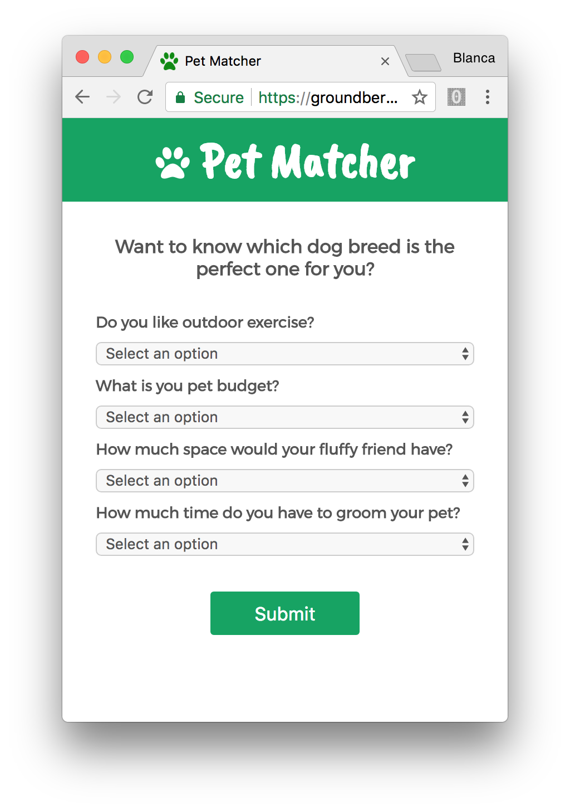
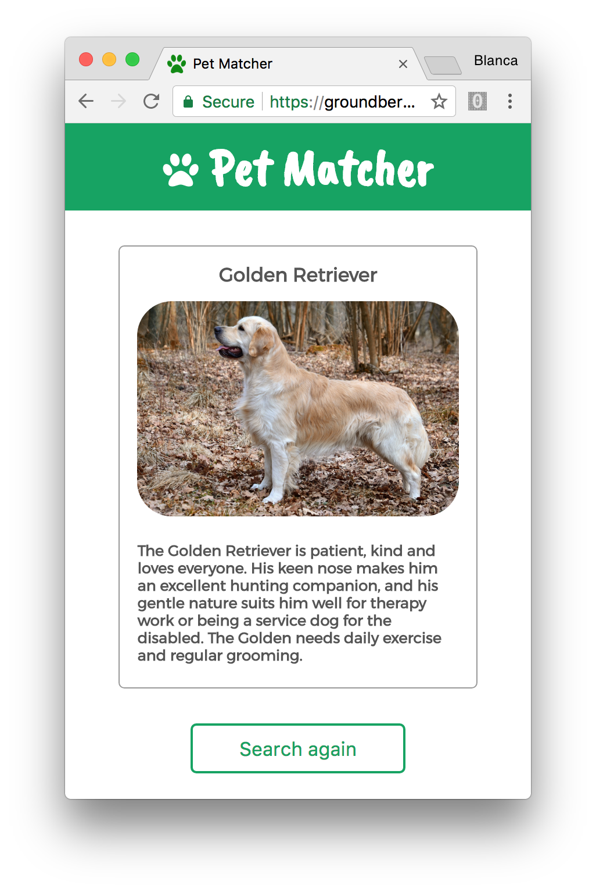
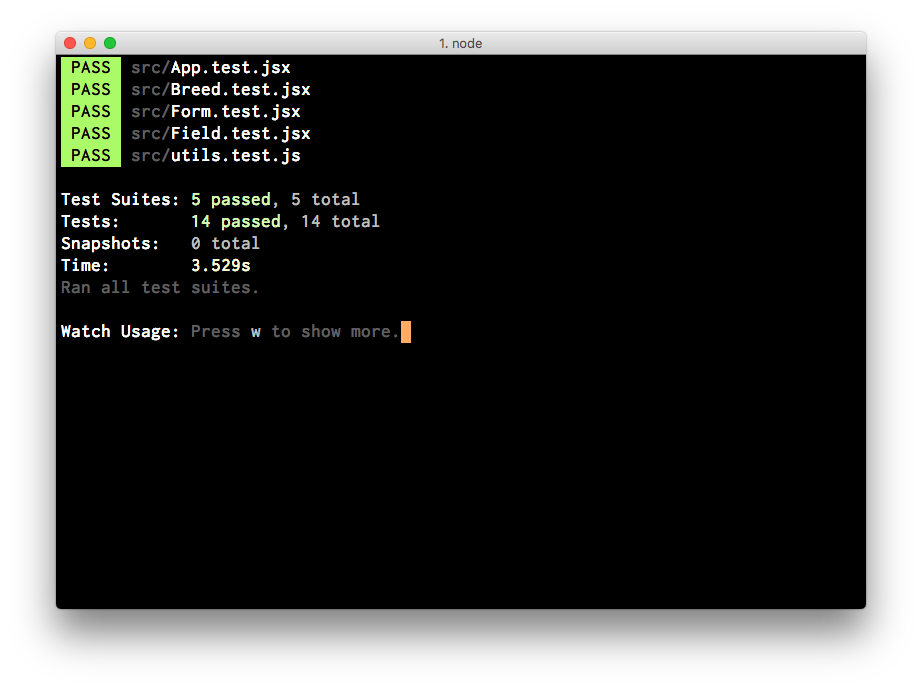

# Pet Matcher

Answering a few questions you'll know which dog breed is the perfect one for you!

## Functionality

- As a user, I can answer the questions listed in a form.
- As a user, I can submit my answers.
- As a user, I can see the result breed that matches my answers.
- As a user, I can submit a new set of answers.




## Future features

This is the first version of the app. I'll redesign it so that the matching breed is obtained through a decision tree and the breeds' data is stored in a database instead of in the state of the App component.

## Running the app

Clone this repo:

```
$ git clone https://github.com/groundberry/pet-matcher
```

Install all dependancies:

```
$ npm install
```

Start the server:

```
$ npm start
```

And open the app in your browser at <http://localhost:3000/>.

## Testing the app

Run the tests:

```
$ npm run test
```

